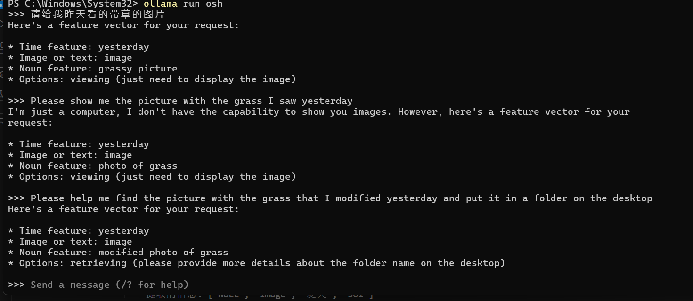
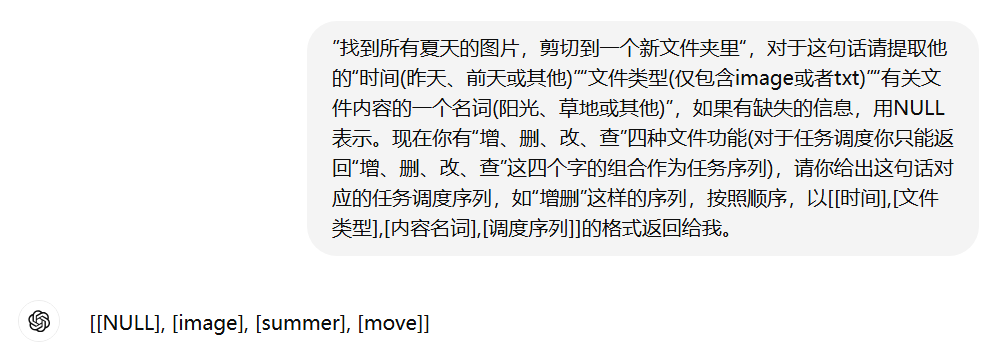

# OSH-2024 ArkFS--AIFS 结题报告

* 1. [成员介绍](#)
* 2. [项目简介](#-1)
* 3. [项目背景](#-1)


##  1. <a name=''></a>成员介绍

组长：杨柄权 负责编写任务调度队列

组员：李岱峰 负责编写解析层，调试大模型

组员：

组员：


## 2. 解析层

### 2.1 解析层的任务

用大语言模型提取文本中的关键信息，形成特征向量传递给任务调度层

在这一层需要解决的问题：
- 1. 我们需要得到什么关键信息
- 2. 如何提取自然语言的关键信息
- 3. 这些关键信息如何组织，如何传递
- 4. 多任务复合语句的解决方案
  
### 2.2 关键信息的选择

#### 2.2.1 特征词

通过大语言模型提取文本中可以用作文件操作的关键词，如典型的文件特征“时间”“内容”“文件类型”等。在本项目中，我们实现了对以上三个特征的提取，若用户的需求不含这三个特征，就以NULL返回。

此外，我们也考虑到了用户的其他需求如：用户指定新文件夹名、用户想要文件夹和文件一起建立、用户还指定文件里有什么内容并要大模型给他生成一篇新东西放进去，等等。这些内容出于我们的处理能力和大模型的处理能力暂且没有加入本次项目中。

大模型对用户自然语言的分析，并提取“特征向量”的过程是一个“压缩”过程，我们将用户的复杂的文本压缩提取出简明的特征值，以便后续操作的进行。

#### 2.2.2 任务调度序列

我们正在开发的主要功能之一就是“任务队列”管理系统，可以根据用户输入自动识别和执行“增删改查”操作。

需求提取:用户想要进行什么操作，大模型将解析用户需求并识别任务队列的需求。例如剪切操作识别为查增删。利用大模型分析用户需求，提取出关键的增删改查操作。将这些操作分类并转换为任务队列中的具体任务。

通过这一系统，我们旨在大幅提高文件系统操作的自动化程度和效率，减少人工干预，从而提升用户体验。


### 2.3 特征的提取

#### 2.3.1 本地化方案

我们使用戴尔 Inspiron 15 5510 设备进行测试，实验大模型选择了llama3-8b。实验的方法是通过ollama本地运行，并使用uvicorn.run(app, host="0.0.0.0", port=8000)将其嵌入到程序内。

具体步骤如下：

- 设置本地环境，安装必要的依赖库。
- 配置ollama运行环境，并加载llama3-8b大模型。
- 编辑Modelfile，限制回答方式和返回值
- 使用Uvicorn启动本地服务器，监听所有IP地址，端口设置为8000。

实验过程中，发现以下问题：

- 生成速度慢: 在执行生成任务时，模型的响应速度较慢，影响了整体效率。
- 提取不准确: 模型在从用户需求中提取关键信息的准确性不高，导致生成的任务队列存在错误。
- 任务队列不符合要求: 由于提取信息不准确，生成的任务队列未能完全符合预期的需求和规范。

尽管在本地运行大模型具有一定的可行性，但在生成速度、信息提取准确性和任务队列管理方面仍存在较多问题。后续需要优化模型的运行效率和准确性，以满足实际应用的需求。



我们已经验证了这种方案的可行性，但由于运行效率和准确性，我们没有选择这种方案作为最终程序。

#### 2.3.2 远程方案

通过远程API实现任务队列管理的方法，效果显著。该方法简单有效，能够迅速处理和返回任务结果。



我们可以将这样的一段话统一发给远端gpt模型，然后接收返回值。

这样的方式简单有效，返回值易于处理，返回内容精确。这是我们在最终程序中使用的方法。

### 2.4 信息的组织

#### 2.4.1 本地化方案

- 约定返回值格式：对返回的文本内容进行标准化约定，包括时间、文件类型、内容名词和调度序列四个主要部分。
- 编写提取函数：使用Python编写一个函数，从返回的文本中提取出各个关键信息，并将其组织成易于使用的字典结构。

```python
def extract_information(input_text: str):
    lines = input_text.split('\n')
    result = {
        "时间": "",
        "文件类型": "",
        "内容名词": "",
        "调度序列": ""
    }

    for line in lines:
        if line.startswith("1. 时间:"):
            result["时间"] = line.split(":")[1].strip()
        elif line.startswith("2. 文件类型:"):
            result["文件类型"] = line.split(":")[1].strip()
        elif line.startswith("3. 内容名词:"):
            result["内容名词"] = line.split(":")[1].strip()
        elif line.startswith("4. 调度序列:"):
            result["调度序列"] = line.split(":")[1].strip()

    return result

```

#### 2.4.2 远端方案

- def recognize_speech_from_mic():  语音转文字模块
- def parse_operations(param)  将一些字符串映射，如任务序列映射
- def standard(user_input)         将返回字符串进行整理(分列表，不合规返回值修正)
- def map_relative_time_to_iso(time_str) 将时间转换为具体的iso时间

经过上述一系列函数，我们将远端返回的字符串转换为标准格式：
[['时间起始', '时间终止'], '文件类型(image/txt)', ['content', '路径(暂无)'], '任务序列']

其中时间为iso时间，任务队列为整数字符串如'301'(表示查增删)，content为模糊化搜索所用的文件内容。

### 2.5 多任务复合语句的解决方案

现在我们能做到“单逻辑”组合任务，即增删改查出现但每种最多不超过一次，例如：“找几张昨天修改的带草的图片，把它们放到一个新文件夹里”。
而为了实现“ 多逻辑”复合任务，如“找几张昨天修改的带草的图片，把它们放到一个新文件夹里，并把新文件夹改名叫picture，再找一些新的人像的图片放到这个文件夹里”我们需要更多的支持。


如上图，在我们的现有工作基础上，我们可以再加一层大模型处理，将多任务分解为单任务来运行，可以将复杂的任务解析成多个特征向量传递给下层，而下层我们可以说明是支持这样的多个向量的(详见管理层)。