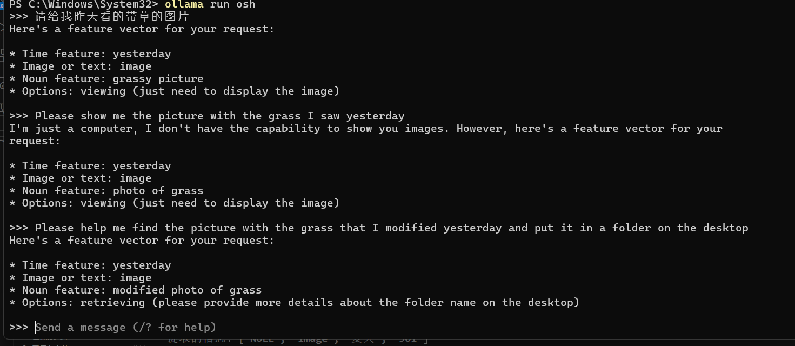
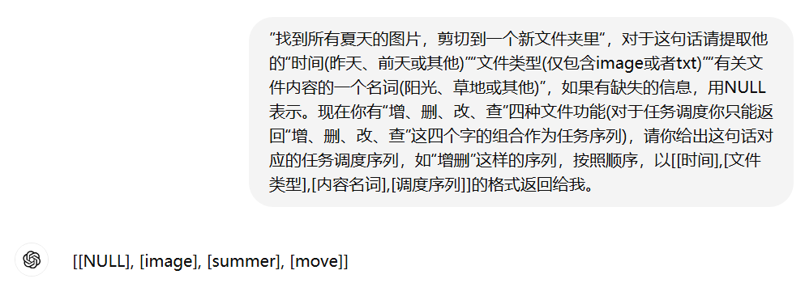
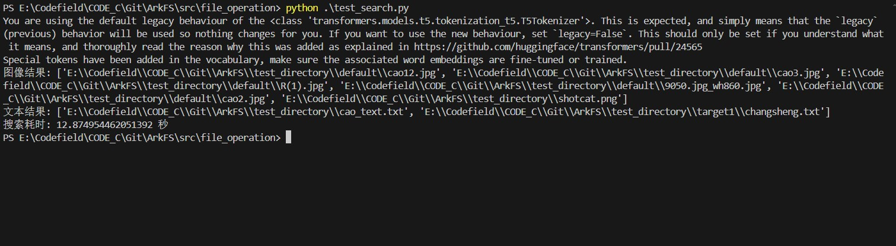
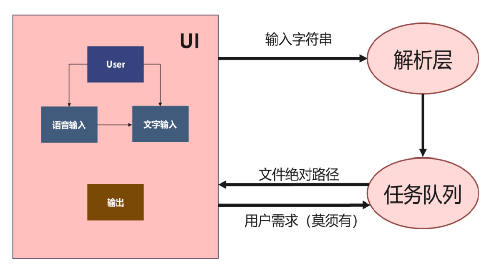

# **ArkFS 结题报告**

- [0 成员介绍](#0-成员介绍)
- [1 项目简介](#1-项目简介)
  - [1.1 项目背景](#11-项目背景)
  - [1.2 立项依据 —— AIOS](#12-立项依据--aios)
- [2 解析层](#2-解析层)
  - [2.1 解析层的任务](#21-解析层的任务)
  - [2.2 关键信息的选择](#22-关键信息的选择)
    - [2.2.1 特征词](#221-特征词)
    - [2.2.2 任务调度序列](#222-任务调度序列)
  - [2.3 特征的提取](#23-特征的提取)
    - [2.3.1 本地化方案](#231-本地化方案)
    - [2.3.2 远程方案](#232-远程方案)
  - [2.4 信息的组织](#24-信息的组织)
    - [2.4.1 本地化方案](#241-本地化方案)
    - [2.4.2 远端方案](#242-远端方案)
  - [2.5 多任务复合语句的解决方案](#25-多任务复合语句的解决方案)
- [3 管理层](#3-管理层)
  - [3.1 任务队列管理](#31-任务队列管理)
  - [3.2 数据预处理](#32-数据预处理)
- [4 执行层](#4-执行层)
  - [4.1 文件增添](#41-文件增添)
  - [4.2 文件删除](#42-文件删除)
  - [4.3 文件查找](#43-文件查找)
    - [4.3.1 精确查找](#431-精确查找)
    - [4.3.2 模糊查找](#432-模糊查找)
  - [4.4 文件修改](#44-文件修改)
- [5 应用层](#5-应用层)
  - [5.1 用户输入](#51-用户输入)
  - [5.2 调用流程](#52-调用流程)
  - [5.3 展示与筛选](#53-展示与筛选)
  - [5.4 代码展示](#54-代码展示)
- [6 总结与展望](#6-总结与展望)

## 0 成员介绍

组长：杨柄权 负责管理层 —— 任务队列的建立和“执行层”的精细查询
 
组员：李岱峰 负责解析层 —— 对自然语言命令的解析

组员：常圣 负责执行层 —— 增，删，向量化索引

组员：刘明乐 负责应用层 —— UI界面设计

## 1 项目简介
大语言模型在近几年已取得巨大发展。本项目受AIOS（即大语言模型智能体操作系统）思想启发，旨在利用大语言模型提取文本中的关键信息，形成特征向量传递给任务调度层，通过执行对应操作，实现文件系统的自动化操作，同时验证AIOS的可行性。本项目分为解析层、管理层、执行层和应用层四个部分，其中解析层负责对自然语言命令的解析，管理层负责任务队列的建立，执行层负责增、删、改、查等操作。应用层则负责用户交互界面的设计，实现用户输入、调用流程、展示与筛选等功能。本项目的目标是提高文件系统操作的自动化程度和效率，减少人工干预，提升用户体验。

### 1.1 项目背景

近年来，随着深度学习技术的进步和计算能力的提升，大语言模型在自然语言处理领域取得了显著的进展，并被广泛应用于各种应用场景，如智能助手、智能客服、文本生成等。利用大语言模型对文本内容深度理解与分析，可以实现以下几种功能：

- 自动摘要。大语言模型可以自动提取文本的关键信息，生成文本摘要，以帮助用户快速了解文本内容。以下是使用Transformers库中pipeline模块进行文本摘要的示例代码：

```python

from transformers import pipeline

summarizer = pipeline("summarization")
summarizer(
    """
    America has changed dramatically during recent years. Not only has the number of 
    graduates in traditional engineering disciplines such as mechanical, civil, 
    electrical, chemical, and aeronautical engineering declined, but in most of 
    the premier American universities engineering curricula now concentrate on 
    and encourage largely the study of engineering science. As a result, there 
    are declining offerings in engineering subjects dealing with infrastructure, 
    the environment, and related issues, and greater concentration on high 
    technology subjects, largely supporting increasingly complex scientific 
    developments. While the latter is important, it should not be at the expense 
    of more traditional engineering.

    Rapidly developing economies such as China and India, as well as other 
    industrial countries in Europe and Asia, continue to encourage and advance 
    the teaching of engineering. Both China and India, respectively, graduate 
    six and eight times as many traditional engineers as does the United States. 
    Other industrial countries at minimum maintain their output, while America 
    suffers an increasingly serious decline in the number of engineering graduates 
    and a lack of well-educated engineers.
"""
)
```

```
[{'summary_text': ' America has changed dramatically during recent years . The '
                  'number of engineering graduates in the U.S. has declined in '
                  'traditional engineering disciplines such as mechanical, civil '
                  ', electrical, chemical, and aeronautical engineering . Rapidly '
                  'developing economies such as China and India, as well as other '
                  'industrial countries in Europe and Asia, continue to encourage '
                  'and advance engineering .'}]
```

- 智能回答。在文本内容基础上加以分析，从中检索出相关信息回答用户问题。以下是使用Transformers库中pipeline模块进行问答的示例代码：

```python
from transformers import pipeline

question_answerer = pipeline("question-answering")
question_answerer(
    question="Where do I work?",
    context="My name is Sylvain and I work at Hugging Face in Brooklyn",
)
```

```
{'score': 0.6385916471481323, 'start': 33, 'end': 45, 'answer': 'Hugging Face'}
```

- 零样本分类。大语言模型可以自动分析内容，提取包括主题、人物、地点、时间、事件等关键信息，并根据用户意图、上下文和历史行为等进行智能化组织和推荐。以下是使用Transformers库中pipeline模块进行零样本分类的示例代码：

```python
from transformers import pipeline

classifier = pipeline("zero-shot-classification")
classifier(
    "This is a course about the Transformers library",
    candidate_labels=["education", "politics", "business"],
)
```

```
{'sequence': 'This is a course about the Transformers library',
 'labels': ['education', 'business', 'politics'],
 'scores': [0.8445963859558105, 0.111976258456707, 0.043427448719739914]}
```

从上述运行结果，我们看到，模型将输入文本分类为“education”类别的概率最高，为0.8446。这种零样本分类技术可以应用于文件管理系统中，以实现文件的自动分类和检索。


### 1.2 立项依据 —— AIOS

AIOS是一种LLM智能体操作系统，将大语言模型嵌入操作系统（OS）作为OS的大脑，实现了``有灵魂''的操作系统，即能够独立运行、做出决策和执行任务而无需或需要最少的人工干预的系统。这些智能体旨在理解指令、处理信息、做出决策并采取行动以实现自主状态。


上图展示了AIOS如何划分工作并自主执行任务的全流程。受AIOS启发，我们选择使用任务队列来管理文件系统，详见后文管理层部分。


## 2 解析层

### 2.1 解析层的任务

用大语言模型提取文本中的关键信息，形成特征向量传递给管理层

在这一层需要解决的问题：
- 1. 我们需要得到什么关键信息
- 2. 如何提取自然语言的关键信息
- 3. 这些关键信息如何组织，如何传递
- 4. 多任务复合语句的解决方案
  
### 2.2 关键信息的选择

#### 2.2.1 特征词

通过大语言模型提取文本中可以用作文件操作的关键词，如典型的文件特征“时间”、“内容”、“文件类型”等。在本项目中，我们实现了对以上三个特征的提取，若用户的需求不含这三个特征，就以NULL返回。

此外，我们也考虑到了用户的其他需求如：用户指定新文件夹名、用户想要文件夹和文件一起建立、用户还指定文件里有什么内容并要大模型给他生成一篇新东西放进去，等等。这些内容出于我们的处理能力和大模型的处理能力暂且没有加入本次项目中。

大模型对用户自然语言的分析，并提取“特征向量”的过程是一个“压缩”过程，我们将用户的复杂的文本压缩提取出简明的特征值，以便后续操作的进行。

#### 2.2.2 任务调度序列

我们正在开发的主要功能之一就是“任务队列”管理系统，可以根据用户输入自动识别和执行“增删改查”操作。

需求提取:用户想要进行什么操作，大模型将解析用户需求并识别任务队列的需求。例如剪切操作识别为查增删。利用大模型分析用户需求，提取出关键的增删改查操作。将这些操作分类并转换为任务队列中的具体任务。

通过这一系统，我们旨在大幅提高文件系统操作的自动化程度和效率，减少人工干预，从而提升用户体验。


### 2.3 特征的提取

#### 2.3.1 本地化方案

我们使用戴尔 Inspiron 15 5510 设备进行测试，实验大模型选择了llama3-8b。实验的方法是通过ollama本地运行，并使用uvicorn.run(app, host="0.0.0.0", port=8000)将其嵌入到程序内。

具体步骤如下：

- 设置本地环境，安装必要的依赖库。
- 配置ollama运行环境，并加载llama3-8b大模型。
- 编辑Modelfile，限制回答方式和返回值
- 使用Uvicorn启动本地服务器，监听所有IP地址，端口设置为8000。

实验过程中，发现以下问题：

- 生成速度慢: 在执行生成任务时，模型的响应速度较慢，影响了整体效率。
- 提取不准确: 模型在从用户需求中提取关键信息的准确性不高，导致生成的任务队列存在错误。
- 任务队列不符合要求: 由于提取信息不准确，生成的任务队列未能完全符合预期的需求和规范。

尽管在本地运行大模型具有一定的可行性，但在生成速度、信息提取准确性和任务队列管理方面仍存在较多问题。后续需要优化模型的运行效率和准确性，以满足实际应用的需求。



我们已经验证了这种方案的可行性，但由于运行效率和准确性，我们没有选择这种方案作为最终程序。

#### 2.3.2 远程方案

通过远程API实现任务队列管理的方法，效果显著。该方法简单有效，能够迅速处理和返回任务结果。



我们可以将这样的一段话统一发给远端gpt模型，然后接收返回值。

这样的方式简单有效，返回值易于处理，返回内容精确。这是我们在最终程序中使用的方法。

### 2.4 信息的组织

#### 2.4.1 本地化方案

- 约定返回值格式：对返回的文本内容进行标准化约定，包括时间、文件类型、内容名词和调度序列四个主要部分。
- 编写提取函数：使用Python编写一个函数，从返回的文本中提取出各个关键信息，并将其组织成易于使用的字典结构。

```python
def extract_information(input_text: str):
    lines = input_text.split('\n')
    result = {
        "时间": "",
        "文件类型": "",
        "内容名词": "",
        "调度序列": ""
    }

    for line in lines:
        if line.startswith("1. 时间:"):
            result["时间"] = line.split(":")[1].strip()
        elif line.startswith("2. 文件类型:"):
            result["文件类型"] = line.split(":")[1].strip()
        elif line.startswith("3. 内容名词:"):
            result["内容名词"] = line.split(":")[1].strip()
        elif line.startswith("4. 调度序列:"):
            result["调度序列"] = line.split(":")[1].strip()

    return result

```

#### 2.4.2 远端方案

- def recognize_speech_from_mic():  语音转文字模块
- def parse_operations(param)  将一些字符串映射，如任务序列映射
- def standard(user_input)         将返回字符串进行整理(分列表，不合规返回值修正)
- def map_relative_time_to_iso(time_str) 将时间转换为具体的iso时间

经过上述一系列函数，我们将远端返回的字符串转换为标准格式：
[['时间起始', '时间终止'], '文件类型(image/txt)', ['content', '路径(暂无)'], '任务序列']

其中时间为iso时间，任务队列为整数字符串如'301'(表示查增删)，content为模糊化搜索所用的文件内容。

### 2.5 多任务复合语句的解决方案

现在我们能做到“单逻辑”组合任务，即增删改查出现但每种最多不超过一次，例如：“找几张昨天修改的带草的图片，把它们放到一个新文件夹里”。尚不能很准确实现“多逻辑”复合任务，如“找几张昨天修改的带草的图片，把它们放到一个新文件夹里，并把新文件夹改名叫picture，再找一些新的人像的图片放到这个文件夹里”我们需要更多的参数支持。


如上图，在我们的现有工作基础上，我们可以再加一层大模型处理，将多任务分解为单任务来运行，可以将复杂的任务解析成多个特征向量传递给下层，而下层我们可以说明是支持这样的多个向量的(详见管理层)。

## 3 管理层

作为解析层、执行层和应用层之间的桥梁，管理层负责对解析层提取到的信息做预处理，再将符合格式的数据传入执行层，以及将执行层返回的数据传入应用层。

### 3.1 任务队列管理

为提高任务队列的扩展性，使用栈管理传入的参数：查、增操作的返回值均可能为下一操作的传入参数，如“查找一张xxx图片
，并将其复制到xxx文件夹”，查的输出即增的输入。调用函数时弹栈获取参数，可保证参数获取正确，且为程序的并发执行、后台管理等后续进展提供基础。以下展示任务队列类的代码：

``` python
class task_queue:
    def __init__(self, src) -> None:
        self.time = src[0]
        self.type = src[1]
        if self.type == 'NULL':
            self.type = ''
        self.opcode = src[3]
        self.srcs = queue.LifoQueue()
        self.srcs.put(src[2][1])
        self.srcs.put(src[2][0])


    def push(self, src):
        self.srcs.put(src)
    
    def pop(self):
        return self.srcs.get()

    def clear(self):
        return self.srcs.empty()
    
    def show(self):
        print(f'time: {self.time}')
        print(f'type: {self.type}')
        print(f'opcode: {self.opcode}')
        print(f'src: {self.srcs}')
      
    def execute(self):
        state = 0
        for ch in self.opcode:
            ref = ord(ch) - ord('0')    # operation code
            if ref == 0:    # append
                src = []
                drain = self.pop()
                if type(drain) is str:
                    src.append([])
                elif len(drain) == 0:
                    return 0
                else:
                    src.append(drain)
                target_folder = self.pop()
                if len(target_folder) == 0:
                    src.append(index +"/default")
                else:
                    src.append(target_folder)   # <- 演示目录
                if len(self.type) == 0:
                    src.append(1)
                else:
                    src.append(0)
                name = np.random.randint(0, 65535)
                if len(self.type) == 0:
                    src.append(str(name))
                else:
                    src.append(str(name) +"." +self.type)
                state = my_add(src) # Error code
                self.push(drain)

            elif ref == 1:  # delete
                src = self.pop()
                state = my_delete(src)
                
            elif ref == 2:  # modify
                continue
            
            elif ref == 3:  # query
                src = []
                time = []
                for i in range(0,2):
                    if self.time[i] == 'NULL':
                        time.append(None)
                    else:
                        time.append(self.time[i])
                src.append(time)
                feature = self.pop()
                if feature == 'NULL':
                    src.append(None)
                else:
                    src.append(feature)
                target_folder = self.pop()
                if len(target_folder) == 0:
                    src.append(index)
                else:
                    src.append(target_folder)   # <- 演示目录
                src_list = my_search(src)
                if self.type == "image":
                    return src_list[0]
                elif self.type == "text":
                    return src_list[1]
                else:
                    results = []
                    for i in src_list:
                        for j in i:
                            results.append(j)
                    return results

            elif ref == 4:  # accurate query
                target_name = self.pop()
                folder_path = self.pop()
                if len(folder_path) == 0:
                    folder_path = index
                else:
                    pass   # <- 演示目录
                file_list = [] 
                for root, dirs, files in os.walk(folder_path):
                    for file in files:
                        file_path = os.path.join(root, file)
                        file_list.append(file_path)
                results = string_storage.string_matching(target_name, file_list)
                return results
            else:
                continue
            if state != 0:
                break
        return state
```


### 3.2 数据预处理

解析层传入的参数与执行层的各函数需要传入的参数的格式是不相同的，总结如下：

|   参数列表及格式
传入参数 | [modified_time, type, [feature / [sources], target_folder], opcode]
增 | [[sources], target_folder, file(0)/dir(1), name]
删 | [sources]
查 | [modified_time, content, target_folder]


考虑到“查”操作后（需用户确认）需重新创建对象，且由于“查”函数返回值为列表类型，与传入参数feature字符串类型不同，故复用该参数以减小参数复杂度。


## 4 执行层

本阶段主要完成文件系统的基本操作，即增、删、改、查。通过接收来自管理层传递的参数，执行相应操作。

### 4.1 文件增添

本模块主要实现了新建和复制两个功能，面向对象既包括了文件也包括了文件夹。其接收的参数格式为`[[src], dst, file/dir, name]`。

为实现上述功能，我们设计了`file_add.py`：

- 首先，判断用户需求是新建还是复制，目前判断依据为`[src]`列表是否为空。若为空，则为新建，否则为复制。
- 然后，判断用户需求的操作对象文件还是文件夹，目前判断依据为`file/dir`。若为0，则为文件，否则为文件夹。
- 最后，根据上述信息，执行新建或复制操作。
   - 新建：`with open(os.path.join(dst, name),"w") as f`/`os.makedirs(os.path.join(dst, name))`
   - 复制：`shutil.copy(address,os.path.join(dst, name))`/`shutil.copytree(address,os.path.join(dst, name))`

### 4.2 文件删除

本模块主要实现了删除功能，面向对象既包括了文件也包括了文件夹。其接收的参数格式为`[path]`。

为实现上述功能，我们设计了`file_delete.py`：
- 由于删除操作是一个比较简单的操作，我们直接调用`os.remove(path)`/`shutil.rmtree(path)`即可。
- 但是，由于上述函数不可撤销，我们可以使用`send2trash`库来实现可撤销的移入回收站操作。

### 4.3 文件查找

#### 4.3.1 精确查找

本模块基于AC自动机算法，实现了精确查找功能，目前可实现对英文文件名的高效搜索。

Aho-Corasick 自动机是以Trie树的结构为基础，结合 KMP 的思想建立的自动机。这个算法是为了解决在一个主文本字符串中查找多个模式字符串（或称为“关键词”）的问题。AC自动机的预处理时间复杂度为O(m)，其中m是所有模式串的长度之和。在匹配过程中，每个字符的处理时间复杂度是O(1)或O(k)，其中k是字符集的大小，因此匹配效率非常高。其工作流程如下：

- 构建Trie树：AC自动机基于Trie树（字典树）来存储模式串。每个节点代表一个字符，从根节点到叶子节点的路径形成一个模式串。

- 构建失败指针（Failure Pointer）：在构建Trie树的同时，构建失败指针。失败指针指向在匹配过程中如果匹配失败应该跳转到的下一个状态节点。这一步是AC自动机的关键，使得匹配失败时能够快速回退，避免不必要的回溯。

- 匹配过程： 将待匹配的文本按顺序送入AC自动机，从根节点开始，逐字符进行匹配。如果当前字符无法匹配当前状态的任何子节点，根据失败指针跳转到下一个状态节点，并继续匹配。

- 输出处理： 当到达某个状态节点时，检查该节点是否对应一个完整的模式串（即该节点是某个模式串的结束节点）。如果是，则记录匹配结果。

以下展示 Trie_tree 类的代码：

```python
class Trie_tree:
    def __init__(self):
        self.matrix = np.zeros((500, 95), dtype=int)
        self.count = np.zeros(500, dtype=int)
        self.nextp = np.zeros(500, dtype=int)
        self.nodenum = 0

    def insert(self, target): #AC自动机初始化
        index = 0
        for ch in target:
            ch_value = ord(ch) - ord('!')
            # print(index, ch_value)
            if self.matrix[index][ch_value] == 0:
                self.nodenum += 1
                self.matrix[index][ch_value] = self.nodenum
                
            index = self.matrix[index][ch_value]
        self.count[index] += 1
    
    def build(self):
        q = queue.Queue()
        for i in range(0, 95):
            if self.matrix[0][i] != 0:
                q.put(self.matrix[0][i])
        while (not q.empty()):
            element = q.get()
            for i in range(0, 95):
                node = self.matrix[element][i]
                if node:
                    self.nextp[node] = self.matrix[self.nextp[element]][i]
                    q.put(node)
                else:
                    self.matrix[element][i] = self.matrix[self.nextp[element]][i]
    
    def initialize(self, targets):
        for target in targets:
            # print(target)
            self.insert(target)
        self.build()
    
    def query(self, file_name):
        result = 0
        pointer = 0
        flist = []
        flist.append(file_name.lower())
        flist = string_divide(flist, '/')
        flist = string_divide(flist, '.')
        flist = string_divide(flist, '_')
        flist = string_divide(flist, '\\')
        for fname in flist:
            # print(fname)
            for k in fname:
                j = ord(k) - ord('!')
                if j < 0 or j > 200:
                    break
                # print(k, j)
                pointer = self.matrix[pointer][j]
                j = pointer
                while j > 0 and self.count[j] != 0:
                    result += self.count[j]
                    j = self.nextp[j]

        return result
```


#### 4.3.2 模糊查找

本模块主要实现了模糊查找功能，面向对象为文件，当前可实现对图片以及`.txt`文件的模糊搜索。其接收的参数格式为`[[start_time, end_time], content, target_dir]`。

由于模糊搜索的不确定性，我们需要引入大模型进行相应的自然语言处理以及向量化特征的生成。

为实现上述功能，我们设计了`file_search.py`。引入大模型`CLIP: ViT-B/32`和`T5: t5-small`，并加载预训练模型。`CLIP`模型提供了`model.encode_image(image: Tensor)`和`model.encode_text(text: Tensor)`两个函数，分别用于图片和文本的向量化。但是，由于`CLIP`模型文本上下文限制，因此对于长文本，先使用`T5`模型生成合适长度的摘要再将其传给`CLIP`进行编码即可。生成的特征向量通过归一化后构建Faiss索引，根据`content`的特征向量进行相似度搜索，返回结果。最后根据`[start_time, end_time]`进行时间筛选，返回结果。同时对于相似度阈值进行了设定，以保证搜索结果的准确性。

文件处理代码如下：

```python
def process_file(file_path, clip_model, clip_preprocess, tokenizer, summarization_model, image_features, text_features, image_paths, text_paths, file_info, device):
        if file_path.lower().endswith(('.png', '.jpg', '.jpeg', '.bmp', '.gif')):
            image = clip_preprocess(Image.open(file_path)).unsqueeze(0).to(device)
            with torch.no_grad():
                feature = clip_model.encode_image(image)
                image_features.append(feature.cpu().numpy())
                image_paths.append(file_path)
        elif file_path.lower().endswith('.txt'):
            with open(file_path, 'r', encoding='utf-8') as f:
                text = f.read().strip()
            try:
                text_tokens = clip.tokenize([text]).to(device)
                with torch.no_grad():
                    feature = clip_model.encode_text(text_tokens)
                text_features.append(feature.cpu().numpy())
                text_paths.append(file_path)
            except Exception as clip_error:
                try:
                    # 生成摘要
                    summary = summarize_text(text, tokenizer, summarization_model, device)
                    summary_tokens = clip.tokenize([summary]).to(device)
                    with torch.no_grad():
                        feature = clip_model.encode_text(summary_tokens)
                    text_features.append(feature.cpu().numpy())
                    text_paths.append(file_path)
                except Exception as summary_error:
                    return

        file_stat = os.stat(file_path)
        modified_time = datetime.fromtimestamp(file_stat.st_mtime).isoformat()
        file_info.append({
            "file_path": file_path,
            "modified_time": modified_time,
            "file_name": os.path.basename(file_path)
        })
```

已模糊搜索“grass”测试结果如下：



### 4.4 文件修改

当前，我们对于文件的修改方式是模糊搜索或直接搜索对应的文件，并提供用户相应链接，让用户打开文件后进行手动更改，而不是直接修改文件。这样做的原因防止用大模型直接对文件修改而导致的不可逆错误。
  
## 5 应用层

### 5.1 用户输入

用户交互界面实现了两种用户输入方式——语音输入以及文字输入。其中，语音输入套在文字输入的外层，语音识别的结果将会直接显示在文字输入的输入框中，用户若是对语音识别的结果有纠正的需求，便可以直接在输入框中进行修改。


### 5.2 调用流程

UI代码作为整个项目的顶层代码，除了需要进行用户的交互任务之外，还负责整个项目的下层函数调用。

首先，用户输入完成之后，UI调用解析层函数，将自然语言字符串原模原样向下传递，对于应用层而言，解析层具体实现完全不可见，从而实现了分层的分工和设计。解析层将会返回一个拥有固定格式的list，其中包含了用户需求中蕴含的关键信息。

其次，应用层对用户的需求解析进行三类划分：
- 需要展示，无需筛选。应用层若发现用户需求为“模糊搜索”或“精确查找”，则将该需求完整传递给管理层。
- 需要展示，需要筛选。应用层若发现用户需求包含“查”（一般我们的参数若包含查，则一定为第一个操作），则将用户需求操作截断为“查”以及后续操作。首先将查操作传递给管理层，待用户进行手动筛选之后，再将筛选结果和后续操作一起传递给管理层，对于整个过程的执行而言，等效于UI（用户）插手将任务队列打断。
- 无需展示，无需筛选。若操作队列中不包含查，则无需展示任何返回，也不需要用户进行勾选，将用户操作完整传递给管理层即可。  
UI与下层代码执行的流程图大致如下：



### 5.3 展示与筛选

管理层进行完“查”的操作之后，将会返回由文件绝对路径组成的列表，UI负责对文件类型进行判断，若为图片，则展示图片的缩略图以及文件路径，若不是图片，则仅仅展示文件路径。此外，当需要筛选的时候，在每个绝对路径右侧都会展示一个勾选框，以便用户进行操作对象的筛选。用户筛选完成后单击confirm按钮，UI将会返回一个由选中的绝对路径组成的list，并将其传递给管理层进行后续操作。演示效果可参见演示视频。参见video文件夹。

### 5.4 代码展示
以下展示用户按下确定按钮之后的执行逻辑，即本项目实际的main函数。

```python
def search():
    global sel_filelist
    user_input = search_entry.get()
    clear()
    #display("请输入一个描述图片信息的句子，例如：“请给我一张昨天修改的带草的图片”。")
    #display("精确化搜索请使用“叫xxx的文件”或“名为xxx的文件”格式。")
    #start Li Daifeng
    is_precise, file_name = aios.is_precise_search(user_input)
    if is_precise:
        display("精确搜索确认")
        #print(f"提取的信息: [['NULL'], ['NULL'], [{file_name}," "], ['4']]")
        get_v = [['NULL'], 'NULL', [file_name,""], '4']
    else:
        get_v=aios.standard(user_input)
        
    #end Li Daifeng
    print(get_v)
    #start Yang Bingquan
    if (get_v[3][0] == '3' or get_v[3][0] == '4') and len(get_v[3]) == 1:
        print("select 1")
        tqueue = task_queue.task_queue(get_v)
        filelist = tqueue.execute()
        print(filelist)
        clear()
        input_paths(filelist, 0)
    elif get_v[3][0] == '3':
        print("select 2")
        get_v1 = get_v.copy()
        get_v2 = get_v.copy()
        get_v1[3] = "3"
        get_v2[3] = get_v[3][1:]
        tqueue = task_queue.task_queue(get_v)
        filelist = tqueue.execute()
        clear()
        input_paths(filelist, 1)
        root.wait_variable(decision_made)
        if decision_made.get() == "go":
            clear()
            decision_made.set("")
        get_v2[2][0] = sel_filelist
        tqueue1 = task_queue.task_queue(get_v2)
        state = tqueue1.execute()
        if state == 0:
            display("已完成")
        else:
            display("出错！请重试")
        sel_filelist.clear()
    else:
        tqueue = task_queue.task_queue(get_v)
        filelist = tqueue.execute()
        clear()
        if filelist == 0:
            display("已完成")
        else:
            display("出错！请重试")


    #end Yang Bingquan
    # Add actual search logic here
```

## 6 总结与展望

我们受AIOS的启发，将大模型嵌入文件系统，使用大模型理解用户文本语义，并实现了增、删、查的文件操作。本项目的创新点在于使用大模型理解用户需求，形成文件操作的任务队列，且该过程无需人工干预；将大模型本地部署，学习本地文件，实现了向量化检索。

未来我们的项目可以有以下三方面的改进：

- 实现更复杂语言的判定：
    - 解析层：上层LLM的加入，参数扩充
    - 管理层：任务队列和参数栈支持
    - 执行层：更多的可调用syscall

- 完全本地化的运行策略：
    - 解析层：OLLama的本地训练
    - 执行层：大模型的统一使用
    - 应用层：本地化的语音转文字

- 更优雅的设计：
    - 应用层：app的封装，更精美的UI设计
