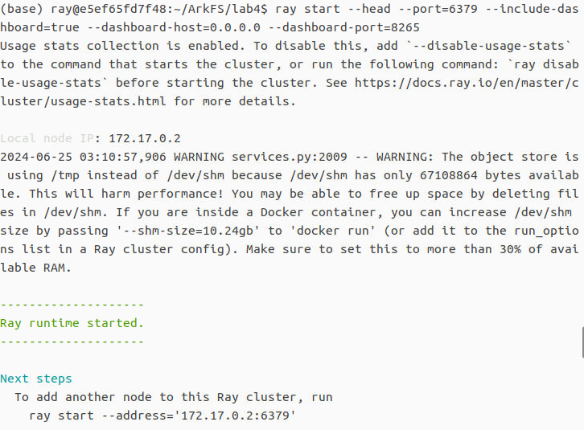
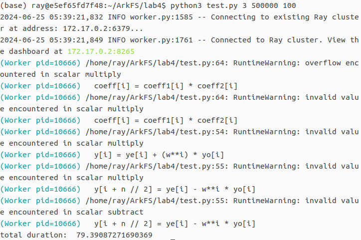

# Lab 4: Ray 的单机部署/分布式部署及性能测试 

## 目录

- [实验简介](#实验简介)
- [测试任务](#测试任务)
    * [性能指标列表](#性能指标列表)
    * [测试程序](#测试程序)
- [单机版部署](#单机版部署)
    * [测试流程](#测试流程)
    * [实验结果](#实验结果)
- [分布式部署](#分布式部署)
    * [实验环境](#实验环境)
    * [测试流程](#测试流程-1)
    * [运行截图](#运行截图)
    * [实验结果](#实验结果-1)
- [基于Docker的分布式部署](#基于Docker的分布式部署)
    * [测试流程](#测试流程-2)
    * [运行截图](#运行截图-1)
    * [实验结果](#实验结果-2)

### 实验简介

在本次实验中，我们小组选择了Ray进行部署，基于FFT算法实现了多项式乘法计算，并使用该程序完成了Ray的测试、分析、评价等工作。该实验报告已在CSDN上发表，其链接为https://blog.csdn.net/qq_60865812/article/details/139971832?spm=1001.2014.3001.5501

### 测试任务

本次实验选择的测试任务为：计算大样本的方差。

#### 性能指标列表

* 延迟(Latency): 延迟是指在计算系统中，从发起一个操作或请求到操作完成之间的时间间隔。它是衡量系统响应速度和效率的重要指标之一。延迟通常以时间单位（如毫秒、微秒等）来衡量，较低的延迟意味着系统响应更快、效率更高。

* 吞吐量(Throughput): 吞吐量是指在单位时间内处理的任务或者操作数量。它是衡量计算机系统或者网络系统性能的重要指标之一，以单位时间内完成的任务数量来衡量。

* 可靠性(Reliability): 可靠性是指可靠性是指系统在特定时间内能够正常运行而不出现故障的能力。它是衡量系统在各种条件下持续运行的程度，通常包括故障率、可用性、容错能力、可恢复性和持久性等。

* 可扩展性(Scalability): 可扩展性是指系统能够有效地处理和应对增加的工作负载或者请求量而不降低性能的能力。

* 资源利用率(Resource Utilization): 资源利用率是指系统中各种资源（如CPU、内存、磁盘、网络带宽等）被有效利用的程度。资源利用率是衡量系统性能和效率的重要指标之一，它直接影响到系统的响应速度、稳定性和成本效益。

为了体现Ray对计算性能的提高作用，我们选取延迟和吞吐量作为后续测试的主要关注点。

#### 测试程序

测试程序使用python完成, 测试时使用指令 `python3 test.py arg1 arg2 arg3`, 其中参数arg1表示多项式的项数以2为底的对数（默认为16）, arg2表示样本个数（默认为1000）, arg3表示任务的划分个数（默认为50000）。为了更好地使用FFT算法, 样本数据采用列表存储，数据由低位到高位对应列表表项由低位到高位。测试程序 `test.py` 如下:
```python
import ray
import time
import sys
import math
import numpy as np

ray.init()

if len(sys.argv) < 2:
    vector_length: int = 16 # default value = 16
else:
    vector_length: int = int(sys.argv[1])
if len(sys.argv) < 3:
    sample_num: int = 1000
else:
    sample_num: int = int(sys.argv[2])
if len(sys.argv) < 4:
    pc_num: int = 50000
else:
    pc_num: int = int(sys.argv[3])
vector_size: int = 2 ** vector_length # 2^16-order polynomial

node_task_num: int = sample_num // pc_num

def FFT(p): # Fast Fourier Transform, p the polyminial
    n = int(len(p))
    if n == 1 :
        return p
    w = math.e ** (2 * math.pi * 1j / n)
    pe = p[::2]
    po = p[1::2]
    ye = FFT(pe)
    yo = FFT(po)
    y = np.empty(n, dtype= complex)
    for i in range(0, n // 2):
        y[i] = ye[i] + (w**i) * yo[i]
        y[i + n // 2] = ye[i] - w**i * yo[i]
    return y

def IFFT(p): # Inverse Fast Fourier Transform, p the polyminial
    n = int(len(p))
    if n == 1 :
        return p
    w = math.e ** (-2 * math.pi * 1j / n)
    pe = p[::2]
    po = p[1::2]
    ye = IFFT(pe)
    yo = IFFT(po)
    y = np.empty(n, dtype= complex)
    
    for i in range(0, n // 2):
        
        y[i] = ye[i] + (w**i) * yo[i]
        y[i + n // 2] = ye[i] - w**i * yo[i]
    return y

def polyminial_mul(p1, p2): # coeffs -> FFT, calculate and inverse the result by IFFT
    coeff1 = FFT(p1)
    coeff2 = FFT(p2)
    coeff = np.empty(len(p1) * 2, dtype= complex)
    
    for i in range (len(coeff2)):
        coeff[i] = coeff1[i] * coeff2[i]
    res = IFFT(coeff)
    for i in range (len(res)):
        res[i] = np.divide(res[i] , len(res))
    return res

@ray.remote
class Worker(object):
    def __init__(self):
        self.size = vector_size
        self.poly = self.poly_init()
        self.res = self.poly.copy()
        self.all_times = sample_num

    def poly_init(self):
        vector = np.random.randint(0, high = 10, size = vector_size, dtype= int)
        res = np.empty(vector_size, dtype= complex)
        for i in range(vector_size):
            res[i] += vector[i]
        return res

    # 计算 p^2
    def calculate(self, times):
        cur_time = time.time()
        task_res = []
        square_sum = np.empty(vector_size * 2, dtype= complex)
        sum = np.empty(vector_size, dtype= int)
        for k in range(times): 
            task = self.poly_init()
            task_copy = task.copy()
            for i in range(len(task)):
                sum[i] += task[i]
            task = polyminial_mul(task, task_copy)
            for i in range(len(task)):
                square_sum[i] += task[i]
        task_res.append(sum, square_sum)
        return task_res

if __name__ == '__main__':
    cur_time=time.time()
    worker = Worker.remote()
    temps=[]
    for i in range(pc_num):
        temp = worker.calculate.remote(node_task_num)
        temps.append(temp)

    result_list = ray.get(temps)

    rsquare_sum = np.empty(vector_size * 2, dtype= complex)
    rsum = np.empty(vector_size * 2, dtype= complex)
    result = 0
    for m in result_list:
        for i in range(len(m[0])):  
            rsum[i] += m[0][i] 
        for i in range(len(m[1])):  
            rsquare_sum[i] += m[1][i] 
            result += m[1][i] * (10 ** i)
    result /= sample_num
    ex = 0
    for i in range(len(rsum)):  
        ex += rsum[i] 
    ex /= sample_num
    result -= ex ** 2
    print("total duration: ", time.time() - cur_time)
```


### 单机版部署

测试机为USTC Vlab虚拟机，其操作系统为Ubuntu 22.04.4 LTS。

#### 测试流程

* 按照以下步骤安装Ray: 

    - 安装python: 

    ```
    sudo apt-get install python
    ```

    - 使用包管理器安装pip:
    ```
    sudo apt update
    sudo apt install python3-pip
    ```

    如果你希望手动安装最新版本的 pip, 可以使用官方提供的 get-pip.py 脚本。以下是安装步骤: 
    ```
    curl https://bootstrap.pypa.io/get-pip.py -o get-pip.py # 使用 curl, 或者使用 wget 方法
    wget https://bootstrap.pypa.io/get-pip.py               # 使用 wget
    sudo python3 get-pip.py   # 对于 Python 3
    sudo python get-pip.py    # 对于 Python 2
    ```

    最后使用`pip --version`命令验证是否安装成功

    - 安装Ray
    ```
    pip install -U ray
    pip install 'ray[default]'
    ```

* 使用 `ray start --head` 命令创建`head`节点

* 如果测试程序命名为 `test.py` 且位于当前工作目录下, 使用`python test.py` 或 `python3 test.py`命令运行测试程序

* 运行创建节点命令之后，会出现如下内容: 

```
To monitor and debug Ray, view the dashboard at 
    127.0.0.1:8265
```

在浏览器中输入该ip地址，即可打开Dashboard查看运行结果

* 输入`ray stop`命令结束测试

#### 测试结果

测试结果截图见result.md。

| 多项式项数 | 样本数量 | 总吞吐量 | pc_num = 1 | pc_num = 10 | pc_num = 100 | pc_num = 1000 | pc_num = 10000 | pc_num = 50000 |
|-------|-------|-------|-------|-------|-------|-------|-------|-------|
| 256 | 100000 | 204800000 | 611.6088 | 615.0404 | 622.7523 | 617.4893 | 673.1099 | 704.8914 |
| 16 | 500000 | 32000000| 151.6565 | 158.4516 | 156.1609 | 153.4860 | 161.6348 | 171.9120 |

由于 FFT 算法的时间复杂度为 O(nlogn), 表中总吞吐量满足`N = n * plogp`, 式中p为多项式项数。由上表可得，当任务划分数小于1000时，其对程序延迟的影响很小，而当任务划分数大于10000时，程序延迟明显增大，我们认为任务数量的增加导致进程间开销增大，显著降低了运行效率，因此需要取一个较小的任务划分数。

使用 `no_ray.py` 测试不使用Ray进行部署时, 总吞吐量为 500000 的程序延迟, 并与上表数据作对比统计如下:

|  | 样本数量 | pc_num = 1 | pc_num = 10 | pc_num = 100 | pc_num = 1000 | pc_num = 10000 | pc_num = 50000 |
|-------|-------|-------|-------|-------|-------|-------|-------|
| 不使用 Ray 部署 | 500000 | 152.3679 | 152.1764 | 152.4549 | 149.3331 | 153.9519 | 156.5193 |
| Ray 的单机部署 | 500000 | 151.6565 | 158.4516 | 156.1609 | 153.4860 | 161.6348 | 171.9120 |

使用 VMWare 虚拟机重新完成该部分实验，得到实验结果如下:

|  | 样本数量 | 总吞吐量 | pc_num = 10 | pc_num = 100 | pc_num = 1000 | pc_num = 10000 | pc_num = 50000 |
|-------|-------|-------|-------|-------|-------|-------|-------|
| 不使用 Ray 部署 | 500000 | 4000000 | 230.1585 | 225.1164 | 202.3590 | 208.3154 | 231.7103 |
| Ray 的单机部署 | 500000 | 4000000 | 245.4086 | 224.2734 | 258.8042 | 274.7173 | 389.0983 |

由上表可得，Ray 的单机部署在一定程度上增大了程序的运行时间，产生了额外的开销; 任务划分数取 100 时程序延迟较小，相较于默认的 pc_num = 50000时提高了 73.49% 的运行效率，因此选定 pc_num = 100 作为后续测试的参数值。

计算以上测试数据的吞吐量（单位: 任务数量/秒）如下:

|  | 多项式项数 | 总吞吐量 | pc_num = 1 | pc_num = 10 | pc_num = 100 | pc_num = 1000 | pc_num = 10000 | pc_num = 50000 |
|-------|-------|-------|-------|-------|-------|-------|-------|-------|
| 不使用 Ray 部署 | 16 | 32000000 | 210017.92 | 210282.24 | 209898.24 | 214286.08 | 207.857.28 | 204447.36 |
| 使用 Ray 部署 | 256 | 204800000 | 669696 | 665968.64 | 657735.68 | 663347.2 | 608.501.76 | 581099.52 |
| 使用 Ray 部署 | 16 | 32000000 | 211002.88 | 201954.56 | 204917.12 | 208488.32 | 197976.96 | 186141.44 |

从表格看出, 多项式项数的增加对于吞吐量的提升是巨大的，任务划分数为1000时，性能提升达到 218.17%，但是考虑到多项式项数较大时, 程序延迟过长, 不利于后续实验的数据统计, 因此选定多项式项数为8作为后续测试的对应参数值。

### 分布式部署

考虑到网络问题，Vlab虚拟机、Ubuntu 子系统、VMWare虚拟机之间无法通过 Ray 进行分布式部署，且组员的 Vlab 虚拟机之间也无法完成互联，我们选择在同一设备上的3台VMWare虚拟机上进行后续的实验。

#### 实验环境

Ray 的分布式部署要求所有机器的 Python 版本相同，经过一系列调整，最终实验环境配置如下。

系统版本：Ubuntu 22.04

Python版本: 3.10.12

Numpy版本: 2.0.0


#### 测试流程

* 按照以下步骤安装Ray: 

    - 安装python: 

    ```
    sudo apt-get install python
    ```

    - 使用包管理器安装pip:
    ```
    sudo apt update
    sudo apt install python3-pip
    ```

    如果你希望手动安装最新版本的 pip, 可以使用官方提供的 get-pip.py 脚本。以下是安装步骤: 
    ```
    curl https://bootstrap.pypa.io/get-pip.py -o get-pip.py # 使用 curl, 或者使用 wget 方法
    wget https://bootstrap.pypa.io/get-pip.py               # 使用 wget
    sudo python3 get-pip.py   # 对于 Python 3
    sudo python get-pip.py    # 对于 Python 2
    ```

    最后使用`pip --version`命令验证是否安装成功

    - 安装Ray
    ```
    pip install -U ray
    pip install 'ray[default]'
    ```

* 在主节点使用 `ray start --head --port=6379 --include-dashboard=true --dashboard-host=0.0.0.0 --dashboard-port=8265` 命令创建 `head` 节点, 此时会出现以下信息:
```
    To monitor and debug Ray, view the dashboard at 
        127.0.0.1:8265
    To add another node to this Ray cluster, run
        ray start --address='192.168.112.242:6379'
```
在浏览器中输入该ip地址，即可打开Dashboard查看运行结果。

* 根据主节点处出现的信息，在从节点使用 `ray start --address='192.168.112.242:6379'` 命令加入 Ray 集群

* 如果测试程序命名为 `test.py` 且位于当前工作目录下, 使用`python test.py` 或 `python3 test.py`命令运行测试程序

* 输入`ray stop`命令结束测试

#### 运行截图


#### 测试结果

测试结果截图见result.md。

|  | 样本数量 | 总吞吐量 | pc_num = 10 | pc_num = 100 | pc_num = 1000 | pc_num = 10000 | pc_num = 50000 |
|-------|-------|-------|-------|-------|-------|-------|-------|
| 不使用 Ray 部署 | 500000 | 12000000 | 230.1585 | 225.1164 | 202.3590 | 208.3154 | 231.7103 |
| Ray 的单机部署 | 500000 | 12000000 | 245.4086 | 224.2734 | 258.8042 | 274.7173 | 389.0983 |
| Ray 的双机部署 | 500000 | 12000000 | 243.8166 | 247.4581 | 242.2816 | 279.8488 | 330.9344 |
| Ray 的三机部署 | 500000 | 12000000 | 201.4612 | 251.2634 | 241.3002 | 275.0589 | 329.7947 |

由以上数据可以得出，当任务数量增多时，创建任务的大量开销和通信开销导致程序的工作效率极大降低，这与单机部署得到的结论是相同的。除此之外，当分布式部署的机器数量增多时，程序的运行时间逐渐下降，证明了分布式部署在大规模任务中的实践价值。

在实验过程中，我们发现局域网的网络延迟对 Ray 分布式计算产生了重要的影响，如图所示:


如图，我们分别使用校园网和手机热点测试了两个相同的任务，在手机热点的局域网下程序的运行时间明显快于校园网下，展示了局域网网速对 Ray 分布式部署的影响。


### 基于Docker的分布式部署

#### 测试流程

* 按照以下步骤安装 Docker: 

    - 安装 Docker: 

    ```
    sudo apt-get install docker.io
    ```

    - 使用如下命令下载Docker镜像
    ```
    sudo docker pull rayproject/ray
    ```

    - 在Docker中运行rayproject/ray, 进入 Ray 环境
    ```
    sudo docker run -it rayproject/ray
    ```


* 在主节点使用 `ray start --head --port=6379 --include-dashboard=true --dashboard-host=0.0.0.0 --dashboard-port=8265` 命令创建 `head` 节点, 此时会出现以下信息:
```
    To monitor and debug Ray, view the dashboard at 
        127.0.0.1:8265
    To add another node to this Ray cluster, run
        ray start --address='192.168.112.242:6379'
```
在浏览器中输入该ip地址，即可打开Dashboard查看运行结果。

* 根据主节点处出现的信息，在从节点使用 `ray start --address='192.168.112.242:6379'` 命令加入 Ray 集群

* 如果测试程序命名为 `test.py` 且位于当前工作目录下, 使用`python test.py` 或 `python3 test.py`命令运行测试程序

* 输入`ray stop`命令结束测试

#### 运行截图



#### 测试结果

由于上文提及的网络原因，基于Docker的分布式部署未能实现，以下仅展示基于Docker的单机部署实验结果，如图所示。




