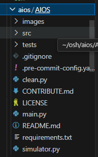

# AIFS: Artificial Intelligence File System

## 中期汇报

 

汇报小组: ArkFS 

成员：杨柄权、常圣、李岱峰、刘明乐

汇报人: 杨柄权

  
    Press Space for next page <carbon:arrow-right class="inline"/>
  

---
layout: image-left
image: https://cover.sli.dev
---

# 目录

<Toc v-click minDepth="1" maxDepth="1"></Toc>

---
transition: slide-right
---

# 项目简介

---
transition: fade-out
---

# 项目背景

近年来，大语言模型发展迅猛，已经在许多领域取得了广泛的应用。

<Transform :scale="0.8">

</Transform>

---
layout: image-right
image: https://cover.sli.dev
---

# 理论依据

## Ext4文件系统

<v-click>

Ext4是第四代扩展文件系统，是Linux系统下的日志文件系统，是Ext3文件系统的后继版本。

</v-click>

<v-click>

- 向后兼容性 

- 大文件系统 

- 分配方式改进 

- 无限制的子目录 

- 日志校验 

- 在线碎片整理 
  
</v-click>

---
transition: slide-up
---

# 技术可行性

## 大语言模型

# 实验计划

根据现实情况，我们设计了一系列验证实验，并将在接下来的几个月内进行验证。
---
## 过去：

 配置好VMware，准备好Gemini/openai的api，测试网络可行；在合适的环境下编译AIOS提供的内核源代码。
---
## 现在：
  使用一些常见的系统调用来完成文件操作.
  分析现有系统调用的性能特征和瓶颈，以及可能的优化方向。
---
## 未来：

### 1.探索尝试
   根据分析结果，选择一些关键的系统调用进行优化，我们将把精力集中在文件管理上，
   编写优化系统调用函数，以提高其性能和效率。
---
### 2.近期展望
   比较优化前后的性能指标，包括系统调用的响应时间、吞吐量等。。
   进行综合性的性能测试和评估，并根据测试结果调整和优化系统调用的实现。
---
### 3.远景目标
   
   实现一个可以智能调用的，可以代替人工操作的，新一代文件管理系统。例如无需用户操作的自动存储，文件自动存储到用户指定位置或大模型认定的"文件相关"位置。

---

## 评测方法：
  ### 对于实现探索尝试阶段：
  观察AIOS提供的内核是否可用，其大模型集成效果：确保系统能够正常启动，并且能够运行常见的任务和应用程序。
---
  ### 对于实现近期展望阶段：
  编写简单的程序来测试新的系统调用，确保其可以正常调用并执行所需的功能。主要通过同一文件索引计时对比：
---
  ### 对于实现远景目标阶段：
  主观体验，新一代大模型集成的文件系统应与传统操作系统有鲜明对比:主要在于用户体验感的极大提升。用户可以通过大模型直接或间接指定文件位置，而不是手动操作文件拖拽。文件的存储策略也应该有很大提升，相邻相关的文件内容应该分配在同一空间内，这些都是我们的愿景目标的直接体现方式。
---

## 挑战与应对

---

### 眼下困境

政策封锁，API可以下载，但无法启动，报错状态码400。  
小组合作寻找VPN多日未果，寻求国外同学帮助。  

---
### 中长期挑战

大模型训练集难以获得，训练方法尚待讨论。  
小组四人，接口优化能否实现，如何实现，需要时间。  
文件系统如何设计，如何优化，需要大量时间尝试。

---
### 应用风险

AI暂不能100%理解人类意图，执行结果差强人意。  
AI黑盒，人类不知晓执行过程，本地文件面临风险。  

---
### 应对措施

1、短期应对：本周之内解决网络封锁问题，进入真正的执行阶段。  
2、中长期应对：大量开会讨论，彻底确定小组工作的细节和方法。  
3、长期应对：反复训练，反复试错，直至达到目标正确率。
---

# 结论

  经过一个月的调研与讨论，我们发现了目前大模型和OS结合的前沿方向，并获得了前人宝贵的开发经验。在此基础上，我们认为我们可以通过更进一步的开发，增加OS的功能，尤其是文件系统的相关功能。
  
  我们设计了实验，打算从AIOS提供的基础版LLM+OS出发，优化一些SDK，并尝试新增一些syscall，来验证我们的工作是可行的，大模型是可以进一步融入文件系统的管理的，相关功能(文件自动归档、依靠大模型搜索文件)是有希望实现的。