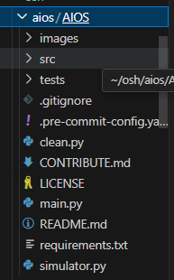
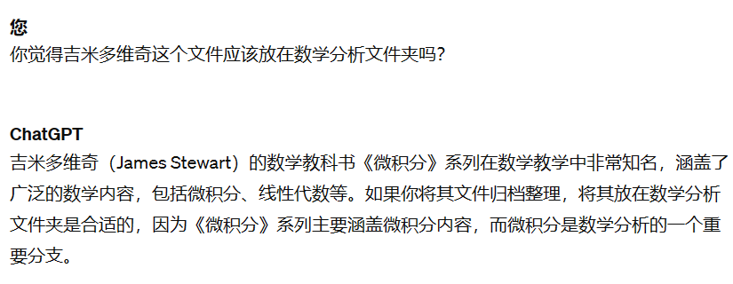

根据现实情况，我们设计了一系列验证实验，并将在接下来的几个月内进行验证。
///
过去：

 配置好VMware，准备好Gemini/openai的api，测试网络可行；在合适的环境下编译AIOS提供的内核源代码。
///
现在：
  使用一些常见的系统调用来完成文件操作.
  分析现有系统调用的性能特征和瓶颈，以及可能的优化方向。
///
未来：

1.探索尝试
   根据分析结果，选择一些关键的系统调用进行优化，我们将把精力集中在文件管理上，
   编写优化系统调用函数，以提高其性能和效率。
2.近期展望
   比较优化前后的性能指标，包括系统调用的响应时间、吞吐量等。
   验证通过系统调用调用LLM（可能是Gemini/OpenAI API）是否可以高效、有序地进行，以确保系统整体性能的提升。
   进行综合性的性能测试和评估，并根据测试结果调整和优化系统调用的实现。
3.远景目标
    实现一个可以智能调用的，可以代替人工操作的，新一代文件管理系统。例如无需用户操作的自动存储，文件自动存储到用户指定位置或大模型认定的"文件相关"位置。
///
评测方法：
  对于实现探索尝试阶段：观察AIOS提供的内核是否可用，其大模型集成效果：确保系统能够正常启动，并且能够运行常见的任务和应用程序。

  对于实现近期展望阶段：编写简单的程序来测试新的系统调用，确保其可以正常调用并执行所需的功能。主要通过同一文件索引计时对比：

  对于实现远景目标阶段：主观体验，新一代大模型集成的文件系统应与传统操作系统有鲜明对比:主要在于用户体验感的极大提升。用户可以通过大模型直接或间接指定文件位置，而不是手动操作文件拖拽。文件的存储策略也应该有很大提升，相邻相关的文件内容应该分配在同一空间内，这些都是我们的愿景目标的直接体现方式。

///
结论

  经过一个月的调研与讨论，我们发现了目前大模型和OS结合的前沿方向，并获得了前人宝贵的开发经验。在此基础上，我们认为我们可以通过更进一步的开发，增加OS的功能，尤其是文件系统的相关功能。我们设计了实验，打算从AIOS提供的基础版LLM+OS出发，优化一些SDK，并尝试新增一些syscall，来验证我们的工作是可行的，大模型是可以进一步融入文件系统的管理的，相关功能(文件自动归档、依靠大模型搜索文件)是有希望实现的。