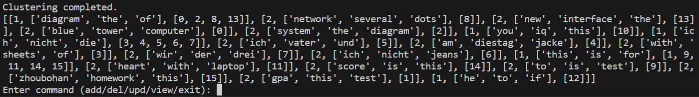

# 根据5.30会议精神，该目录下为近期工作

##  1.动态能力--李岱峰

整个程序应该在一种全动态的情况下运行在系统底层，意味着每次增删改查都对应一系列操作。

在增删改的情况下，我们不可避免的会遇到documents的更改，意味着聚类的变化。新的聚类应该最大程度的避免旧文件的移动，我认为应该采取投放的方式，如果新文件符合原有的聚类，就将新文件投放到就聚类里，否则新建一个聚类，这样可以避免已经存在的聚类不断改变，减少开销。

我将程序改造为了shell的形式，命令行操作来展示增删改查的操作方式。

初始的情况下，可以设置5个聚类，但随着文档增多，聚类也可以变得更多。我设计为每个聚类中的信息必须相近度达到一定程度，否则可以新增一个聚类。这样来动态维护聚类，相应的，增加一个聚类意味着新的树根，而一个聚类里新的文件索引意味着一个新的树结点。

##  2.第一次文本学习能力--李岱峰

我在6.1更新--6.1update.py中为程序添加了第一次初始化前，对目标文件夹target_folder中的所有内容进行文本学习的能力，用于维护documents，完成了开会内容的第二部分。

所有大模型本地运行。支持文本文件测试，图片文件有待测试。

##  3.多层数据索引结构--李岱峰

6.2更新 6.2update.py中，我完成了多层聚类的设计，即在每个桶里加入更小的桶。输出的结构请看117行，155行。

## 4.输出对齐--李岱峰

6.13更新，6.13update.py中，我删除了不必要的io，添加了多核心并发处理程序，并将输出与刘明乐同学、杨柄权同学需要的输入对齐。修复图片内容提取失败的bug。

## 5.数据结构建立--刘明乐

6.27更新，李岱峰同学建立好聚类之后，由本人和杨柄权同学建立存储用的数据结构。经过前期讨论确定由本人建立
以聚类层级和关键字为依据的森林，森林中的每一棵树都代表一个Level1级别的聚类，树中的节点数据域存储
本层级的关键字和index。但仅有最下层的聚类中index为有效值。

## 6.27-bug修复-李岱峰

我修复了view和save的bug，目前每层输出都为全局index，并且有打印representative word。

## 6.28-ret添加-李岱峰

我添加了

这是ret_clusters函数的返回值，其他人可以使用这个进行操作。

